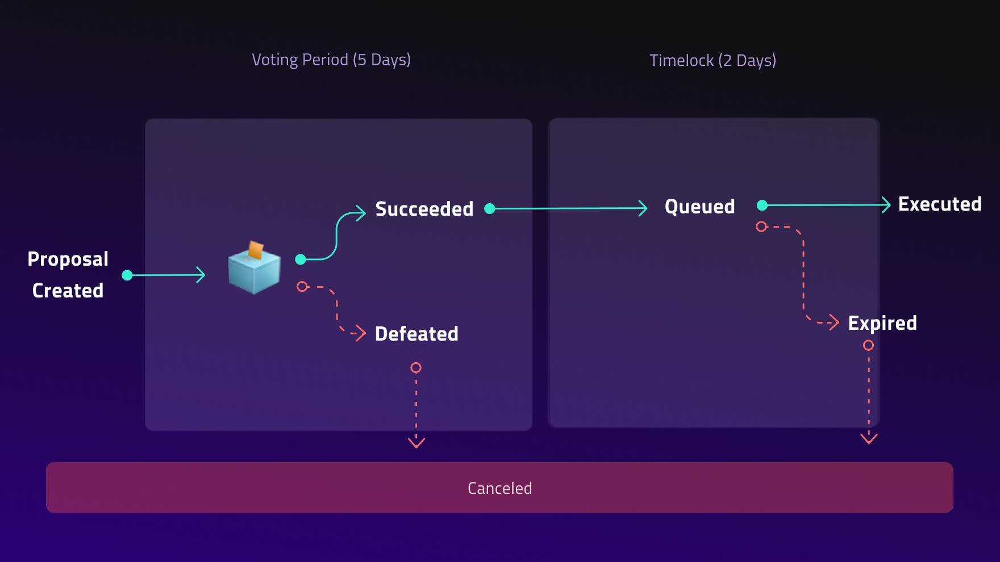

# 🏛️ Overview

The PoolTogether Protocol is governed by the POOL token. Any changes to the Protocol are proposed and voted on by POOL token holders. These proposals can include things like adjusting the number of winners, launching new prize pools, integrating new yield sources, implementing scaling solutions and controlling future distribution of POOL to protocol contributors.

## How Governance Works

Changes to the protocol are submitted as governance proposals. Anyone who either holds 10,000 POOL tokens \(0.1% of total supply\) OR has 10,000 POOL tokens delegated to them can submit a governance proposal. Once submitted governance proposals are voted on for five days. After five days, if the majority of votes are in favor AND at least 100,000 votes have been cast in favor, the proposal will pass. There is a two day “timelock” before the proposal is actually implemented. 

## What Proposals Do 

A proposal can be submitted to do anything but practically speaking, proposals will likely center on a few main topics.

**Controlling governance managed prize pools**

The governance managed prize pools are displayed on app.pooltogether.com. Some parameters on these prize pools are very simple to change, for example, adjusting the number of weekly winners or changing the frequency with which prizes are distributed. We expect proposals will be submitted to adjust these parameters.

**Managing the prize pool builder** 

All prize pools are generated by the prize pool builder. Currently the only yield source supported by the protocol is the Compound Protocol. Many in the community have expressed a desire to add more yield sources. We expect governance proposals to enable prize pools using new yield sources such as Aave.

**Distributing the POOL token**

The broadest category is controlling future distribution of the POOL token. As more people contribute to the protocol by depositing, referring deposits, developing the protocol and other activities governance should continue to distribute control of the protocol to these people. Practically this can look like a referral rewards program, a grants program, a deposit reward program, or direct transfers!

## **Submitting Proposals**

The best place to start is by discussing it in the [governance forum](http://gov.pooltogether.com) and [community Discord](https://discord.gg/peE3axWSEv). 

When it comes time to actually make the proposal, you can review the documentation and use the proposal creation interface available on the "vote" section of the PoolTogether app. You can create proposals without this interface but the interface helps make it more simple for non-technical people. 

[Visit the proposal creation interface!](https://vote.pooltogether.com/proposals/create)

