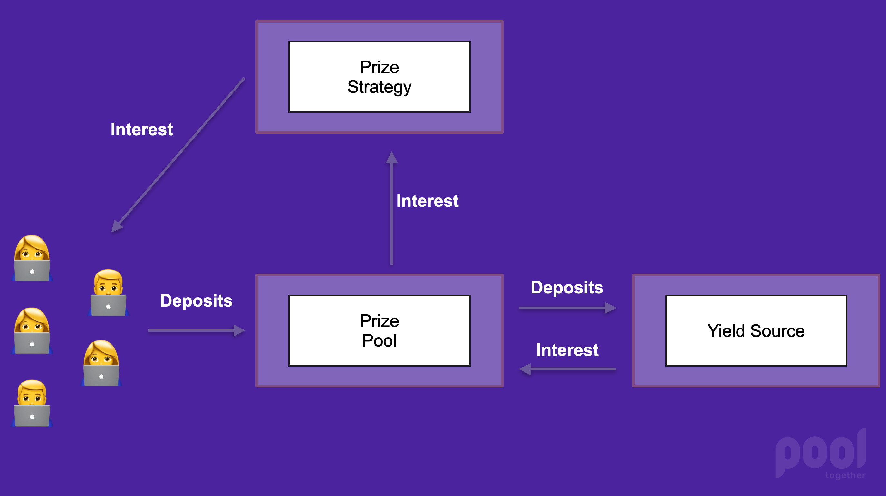

# 🌐 Overview

No-loss prize games are pools of funds whose accrued interest is distributed as prizes.

The high level protocol architecture is outlined below. The code is available on [Github](https://github.com/pooltogether/pooltogether-pool-contracts).

## How it works

1. Users deposit funds into a Prize Pool.  They receive "ticket" tokens in exchange.
2. The funds earn interest.
3. The interest is distributed by the Prize Strategy as ticket tokens.
4. Users withdraw their funds by redeeming their ticket tokens

## Architecture

### [Prize Pools](prize-pool/)

Prize Pools are the central building block of prize games.  They pool user funds in a **yield source** and expose the yield to a **Prize Strategy**, which then disburses as it pleases.

Prize Pools can be differentiated in four primary ways:

* The yield source the prize pool uses to generate no loss return
* The prize strategy used to determine frequency and distribution 
* The rewards offered by the prize pool
* The asset type the prize pool accepts for deposits 

### [Prize Strategies](prize-strategy/)

Prize Strategies determine the prize distribution for the Prize Pool.  They can define any logic to allocate tokens that the prize pool accrues.  Specifically they can:

* Award yield in the Prize Pool as pool tokens
* Award ERC20 tokens held by the Prize Pool
* Award ERC721 tokens held by the Prize Pool

### [Yield Source](yield-sources.md)

Yield sources take deposits and generate interest for the prize pool.  Yield sources must be designed to be no-loss, and adhere to the [Yield Source Interface]().

## Conventions

Fixed point math is used extensively in PoolTogether.  We used fixed point math with 18 decimal places for all fractional numbers.  You can think of this as being just like Ether and wei: a value of "1" Ether is represented as "1000000000000000000" wei.

When a number is a fixed point 18 number we always suffix the number with _mantissa._  For example the credit rate is written as _creditRateMantissa_, because it is a fixed point number.

