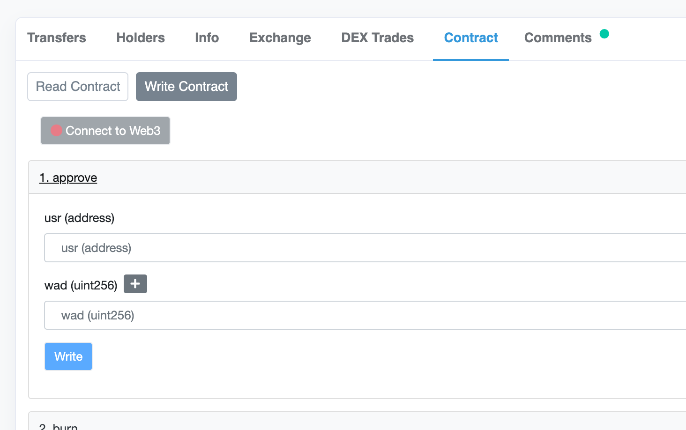
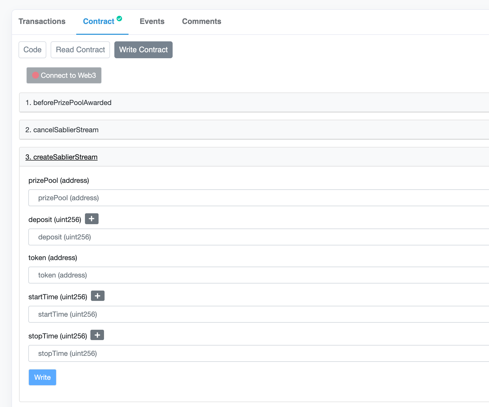

# 🌊 Add a Sablier Stream


Sablier is only supported on the [Ethereum](../resources/networks/ethereum.md) network



Sablier is compatible with the **Multiple Winners** strategy version 3.3.0 or greater.


[Sablier](https://sablier.finance/) allows one to stream tokens to an address.  The sender opens a stream with a start time, end time, token amount and recipient.  As time passes the recipient is able to withdraw more and more of the tokens until finally, when the end time is reached, they can withdraw the last of the tokens.

We've integrated Sablier into PoolTogether so that users can stream tokens to Prize Pools.  Sometimes you want more prizes than the yield offers, or perhaps you're using a [Stake Prize Pool](../protocol/yield-sources/stake-prize-pool.md) so there is no yield.  Streaming takes the hassle out of transferring tokens to the Prize Pool manually.

## Adding a Sablier Stream to a Prize Pool

Sablier streams are managed by the SablierManager.  Each stream sends tokens to a Prize Pool, and the SablierManager is attached to a Prize Strategy in order to trigger the stream withdrawal automatically.

### Step 1: Determine the Stream Parameters

To create the Sablier stream you will need to determine:

* The start time of the stream as a Unix timestamp
* The end time of the stream as a Unix timestamp
* The token to stream
* The amount of tokens to stream
* The prize pool to stream to

#### Calculating Timestamps

To calculate the Unix timestamp you can use the [Epoch Converter](https://www.epochconverter.com/) tool.


The start time of the stream MUST be in the future


#### Calculating the Amount

The amount of tokens to stream **must be evenly divisible by the duration of the stream in seconds**.  For example:

If you are streaming for 30 days, then the duration will be 2592000 seconds.

The amount of tokens you stream must be evenly divisible by 2592000.

To calculate the token amount:

1. Calculate the duration by subtracting the start time from the end time
2. Divide the token amount you want by the duration using the [Big Number Calculator](https://www.boxentriq.com/code-breaking/big-number-calculator).  Note that the token amount should be the full precision number: for example 1 Dai is actually 1e18.
3. The resulting number is your token amount! \(Note that there is no decimal!\) 

### Step 2: Approve of the SablierManager

Navigate to the token you wish to stream on Etherscan and find the approve function:

Enter the SablierManager address as the user, and the stream amount you calculated previously.

### Step 3: Create the Stream

Find the SablierManager on the [Ethereum Networks page](../resources/networks/ethereum.md) and navigate to it on Etherscan.

Enter all the parameters you calculated previously, and hit create!

### Step 4: Attach the SablierManager to the Multiple Winners Prize Strategy

The prize pool you wish to stream to should have a Multiple Winners prize strategy attached to it.  You'll need to add the SablierManager to the prize strategy as a "BeforeAwardListener".

Navigate to the prize strategy on Etherscan and pass the SablierManager address to the `setBeforeAwardListener` function.

**All done!**

