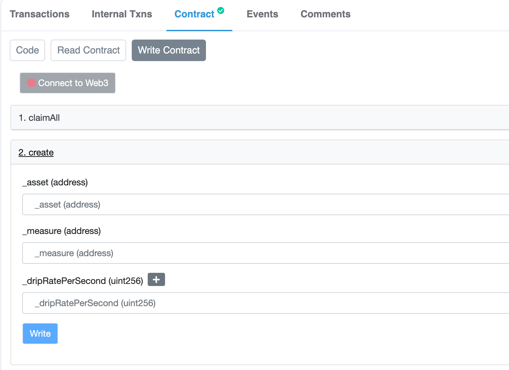
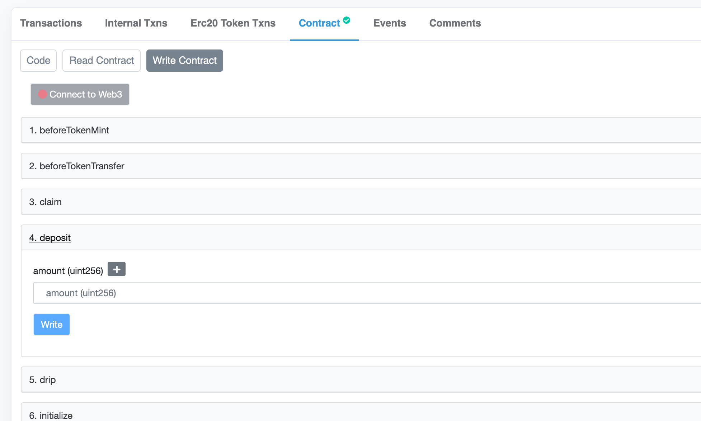

# 🚰 Add a Token Faucet

You might want to distribute a token to your user over time.  This can be accomplished with a Token Faucet.

The Token Faucet drips a certain number of tokens per second.  Those tokens are distributed to users based on their balance of **measure** tokens held.

For example: if the Token Faucet drips 100 tokens per second, and Alice holds 50% of the total supply of **measure** tokens, then she accrues 50 tokens per second.

In order to accomplish this the Token Faucet must be updated before every token transfer; whether it's a mint, transfer or burn.  This is why the Token Faucet implements the [Token Listener]() interface.

To summarize:

* The token faucet distributes a token to holders of a **measure** token.
* The token faucet drips tokens **every second**
* The token faucet implements the [Token Listener]() interface that must be called in order to function correctly.

## Adding a Token Faucet to a Prize Pool

You can create a Token Faucet using the TokenFaucetProxyFactory.  See the [Networks](../resources-1/networks/) page to find a faucet on the network of your choice.

### Step 1: Create the Token Faucet

If you can use Etherscan, navigate to the factory contract's "write" interface tab:

The `create` function creates a new Token Faucet with the parameters:

| Parameter | Description |
| :--- | :--- |
| \_asset | The ERC20 token address that you wish to distribute |
| \_measure | The ERC20 token address that determines each users' portion |
| \_dripRatePerSecond | The number of asset tokens to drip every second.  Keep in mind the denomination is in the smallest unit \(i.e. wei\) |

### Step 2: Attach the Token Faucet to your Prize Pool

The Token Faucet is a [Token Listener](), so you'll need to attach it to your prize pool's **prize strategy**.  The default [Multiple Winners](../protocol/prize-strategy/multiple-winners.md) prize strategy allows you to set the token listener using the `setTokenListener` function.

### Step 3: Deposit Tokens into the Token Faucet

Now you'll need to deposit tokens into the faucet.  Navigate to the faucet in Etherscan and find the `deposit` function:

The deposit function will update the current dripped value \(if any\) and transfer more tokens from the caller into the contract.

Make sure to `approve()` of the token spend by the Token Faucet **first!**

**All Done!**

