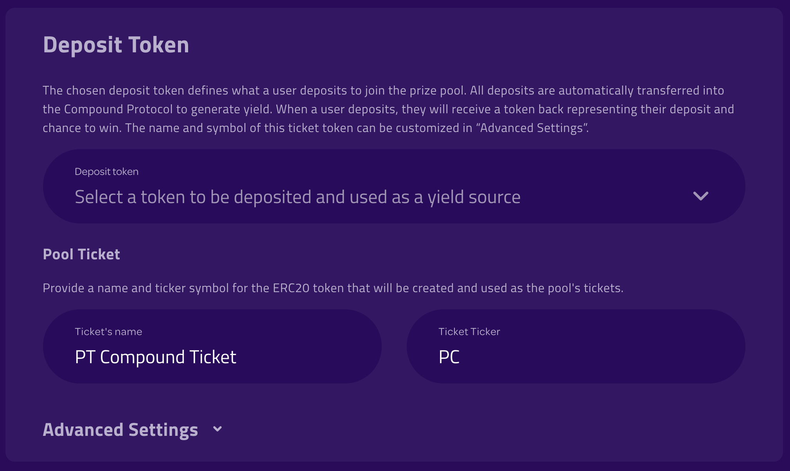
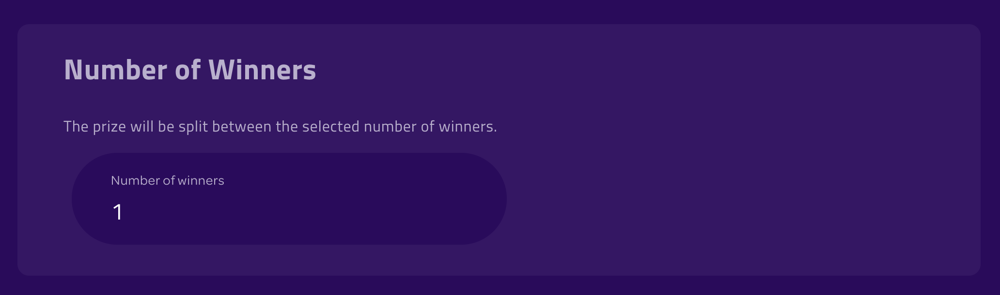
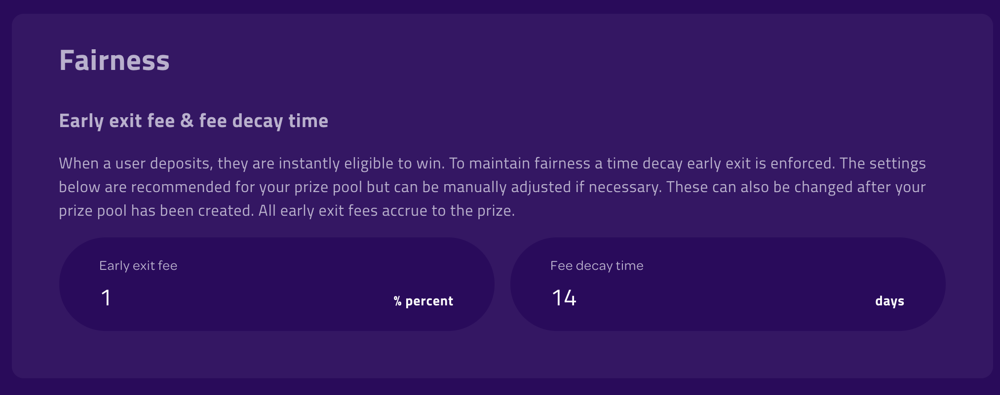

# 🔨 Create a Prize Pool



This tutorial will show you how to create a Compound Prize Pool using the [PoolTogether Builder Interface](https://builder.pooltogether.com/).   The Prize Pool will accept Dai, generate yield from Compound, and split the prize among three winners.

## Pool Type

First, select the Yield Prize Pool \(Compound\) since the prize will be the interest from the Dai locked in Compound. The Pool type allows for either a Yield or Stake Prize Pool to be created.

## Deposit Token

The deposit token will be the token that users stake into the Prize Pool.  For Compound Prize Pools, you are limited to the available Compound Markets.  For Stake Prize Pools you can use any ERC20.  

Select Dai as the token that will be staked in the Prize Pool.

When a user deposits into a Prize Pool, they will get a token in return.  This token represents the underlying collateral at 1:1 exchange rate.

The Builder will create a Prize Pool with two types of tokens: Ticket and Sponsorship.  Ticket tokens represent collateral and the chance to win a prize.  The chance to win is proportional to the number of tickets held.  Sponsorship tokens represent collateral only.  Sponsorship tokens are useful when you want to sponsor a prize.

The name and symbol for the Ticket and Sponsorship tokens are filled with presets, but can be configured.

## RNG Service

A Random Number Generator Service is used to randomly select the winners.  Currently there are two options: the [Blockhash RNG](../protocol/random-number-generator/blockhash.md) and the [Chainlink RNG](../protocol/random-number-generator/chainlink-vrf.md).

The Blockhash RNG is free to use, although it is the least secure method of randomness.

The Chainlink VRF has better security guarantees, but requires **2 LINK per RNG request**.  If you use this RNG, you must 🚨**supply LINK to the Prize Strategy** 🚨.  Note that you must supply LINK to the prize strategy, not the prize pool.

## Prize Period

This will be a weekly awarded prize, so let's set the Prize Period to 7 days. This means that a minimum of 7 days must have elapsed since the previous prize before the next prize can be awarded.  The start time will be the time at which the pool is created.

## Number of Winners

The Prize Pool is created with the [Multiple Winners](../protocol/prize-strategy/multiple-winners.md) prize strategy that splits the prize among multiple winners.  Note that the contract will transfer the tokens to each of the winners, so the more winners you have the higher the gas cost of rewarding will be.

## Fairness

It's possible for a user to deposit immediately before the prize is awarded, then withdraw immediately after.  To mitigate this, prize pools impose an early exit fee to ensure fairness.

The early exit fee is the percent of the withdrawal amount that must be contributed to the prize.  In this case the early exit fee is 1%, so upon withdrawal a user must contribute 1% of the withdrawal amount to the prize.  However, the exit fee decays over time to zero, so that most users can withdraw instantly without any fee.  In this example the exit fee decays to zero over 14 days.  

**Please view the** [**Fairness**](https://docs.pooltogether.com/protocol/prize-pool/fairness) **section of the documentation for more details.**

## Now Create Your Pool!

Push the big button at the bottom.  You're all done!  You're now the proud owner of a Compound Prize Pool.  Ownership comes with special privileges, so that the pool can be managed properly.

To find out how to operate a pool, see the tutorial [Operate a Prize Pool](operate-a-prize-pool/)

