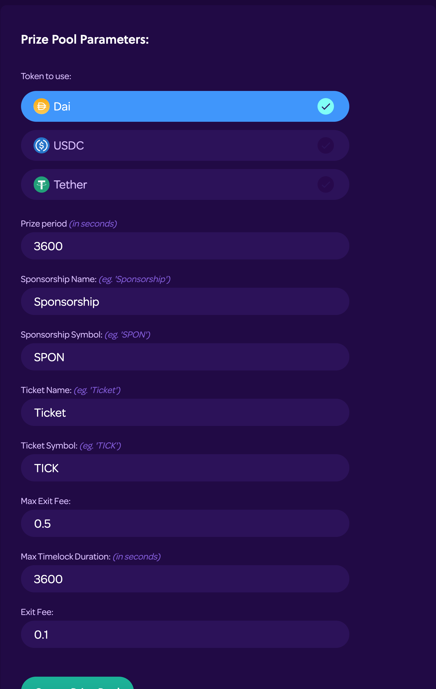

# Creating a Prize Pool

### Using the Builder App

[Prize Pools](../protocol/prize-pool/) can be created using our [Builder](https://builder.pooltogether.com/) app.

Before creating the Prize Pool, you'll need to decide:

* Which Compound cToken to use for yield
* How frequently prizes should be awarded

## Using the Builder Tool

The PoolTogether Prize Pool Builder allows you to create a Prize Pool that awards the prize to a single user.

To begin, navigate to the [Builder](https://builder.pooltogether.com).  Once you connect your wallet, you should see something like:

This will be the configuration to use for the Prize Pool and Prize Strategy.  Let's dig into the config:

<table>
  <thead>
    <tr>
      <th style="text-align:left">Parameter Name</th>
      <th style="text-align:left">Parameter Description</th>
    </tr>
  </thead>
  <tbody>
    <tr>
      <td style="text-align:left">Prize Period</td>
      <td style="text-align:left">This is the duration in seconds that must elapsed between each award.</td>
    </tr>
    <tr>
      <td style="text-align:left">Sponsorship Name</td>
      <td style="text-align:left">The Sponsorship token name</td>
    </tr>
    <tr>
      <td style="text-align:left">Sponsorship Symbol</td>
      <td style="text-align:left">The Sponsorship token symbol</td>
    </tr>
    <tr>
      <td style="text-align:left">Ticket Name</td>
      <td style="text-align:left">The Ticket token name</td>
    </tr>
    <tr>
      <td style="text-align:left">Ticket Symbol</td>
      <td style="text-align:left">The Ticket token symbol</td>
    </tr>
    <tr>
      <td style="text-align:left">Max Exit Fee</td>
      <td style="text-align:left">
        
This value determines the maximum possible early exit fee. It is a fraction
          of the user&apos;s withdrawal. This value is <b>immutable</b> once it is
          set.

        

        
For example, a Max Exit Fee of 0.5 means that the exit fee cannot be greater
          than 50% of the withdrawal amount. If a user attempts to withdraw 100 Dai
          then the early exit fee can be no larger than 50 Dai.

      </td>
    </tr>
    <tr>
      <td style="text-align:left">Max Timelock Duration</td>
      <td style="text-align:left">
        
This value determines the maximum length of time (in seconds) that a users
          funds can be timelocked. This value is <b>immutable</b> once it is set.

        

        
For example, if a user withdraws funds with a timelock then they are guaranteed
          to not have to wait longer than the max timelock duration.

      </td>
    </tr>
    <tr>
      <td style="text-align:left">Exit Fee</td>
      <td style="text-align:left">This is the early exit fee that users will need to contribute if they
        leave the pool early. This value can be changed by the owner after the
        pool is created.</td>
    </tr>
  </tbody>
</table>

