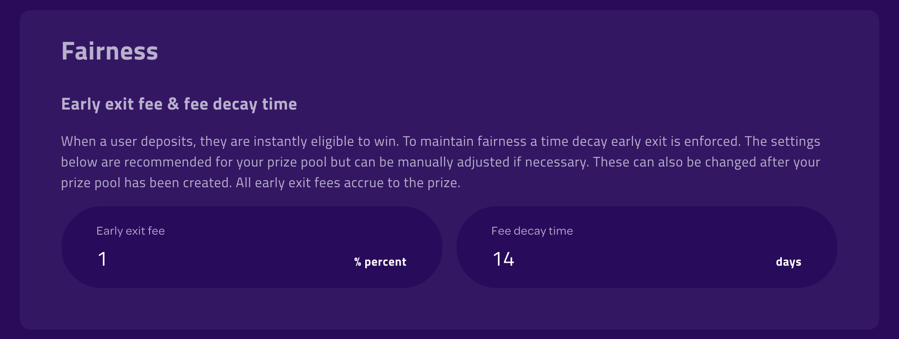

# 🎰 Operate a Prize Pool

Now that you've created a Prize Pool, it is time to learn what goes into operating a Prize Pool. Viewing details about any Prize Pool is made easy with the [PoolTogether Reference App](https://reference-app.pooltogether.com), which displays all the relevant information about any Pool. An example Prize Pool on a testnet can be viewed [here](https://reference-app.pooltogether.com/pools/rinkeby/0x4706856FA8Bb747D50b4EF8547FE51Ab5Edc4Ac2/manage).

## Owner Privileges

When a Prize Pool is created with the Builder, the address that sent the transaction is the owner of both the Prize Pool and default Prize Strategy. These permissions allow the owner to change certain parameters in both the Pool and Strategy contracts once they have been deployed.

Owner privileges include, but are not limited to:

* Managing Awards
* Changing the number of winners
* Updating fairness parameters
* Switching to a Custom Prize Strategy
* Transferring ownership to another address

The [Reference App](https://reference-app.pooltogether.com) has an Admin dashboard which allows for easy access for managing the Prize Pool. Click manage pool and then select the Admin tab to view the different actions.

## Awarding a Prize

The default [Multiple Winners](../../protocol/prize-strategy/multiple-winners.md) prize strategy awards prizes periodically; the prize can be awarded as soon as the prize period has elapsed. The prize is awarded into two phases:

1. **Start Award**: when the prize period has elapsed, anyone can execute the start award transaction.  This will cause the prize strategy to make a request for a new random number from the RNG service.  The **prize strategy** must have enough tokens to pay for the RNG request if payment is required.
2. **Complete Award**: when the RNG is ready with the random number, the complete award transaction can be executed by anyone.  The prize strategy will use the random number to pick the winners, and start a new prize period.

## Awards

Both the Compound Prize Pool and Stake Prize Pool will award the stake token as a prize if there is excess balance. Excess balance may be due to interest accruing, or from users leaving prematurely and paying the early exit fee.

Prize Pools can also award any other ERC20 or ERC721 tokens as prizes. These other tokens must be whitelisted in the [Multiple Winners](../../protocol/prize-strategy/multiple-winners.md) strategy in order to be awarded.

* When an ERC20 is whitelisted, the Multiple Winners strategy will award the token as a prize if the **prize pool** has a non-zero balance.
* When an ERC721 token is whitelisted, the Multiple Winners strategy will award the token as a prize to the **first** winner (if there are multiple winners).

## Number of Winners

The owner has the ability to increase or decrease the number of winners. The default behaviour of multiple winners differs between the Compound Prize Pool and the Stake Prize Pool:

**Compound Prize Pool**

* Any accrued stake tokens are distributed evenly among the winners
* All other ERC20 and ERC721 tokens are given to the first winner

**Stake Prize Pool**

* Any accrued stake tokens are distributed evenly among the winners
* All other ERC20 tokens are split evenly among the winners
* All ERC721 tokens go to the first winner.

## Fairness

The early exit fee must be paid when a user withdraws from a Prize Pool. The fee is a percentage of the withdrawal amount that they must contribute to the prize. However, the fee will decay to zero over time so that users can withdraw without paying any fee.

Here we can see the early exit fee is 1% and the decay time is 14 days. If a user deposits 100 Dai then immediately withdraws, they will need to contribute 1 Dai to the prize. However, if the user waits 14 days after depositing then they can withdraw their full amount.

**Please view the** [**Fairness**](../../protocol/prize-pool/fairness.md) **section of the documentation for more details.**

